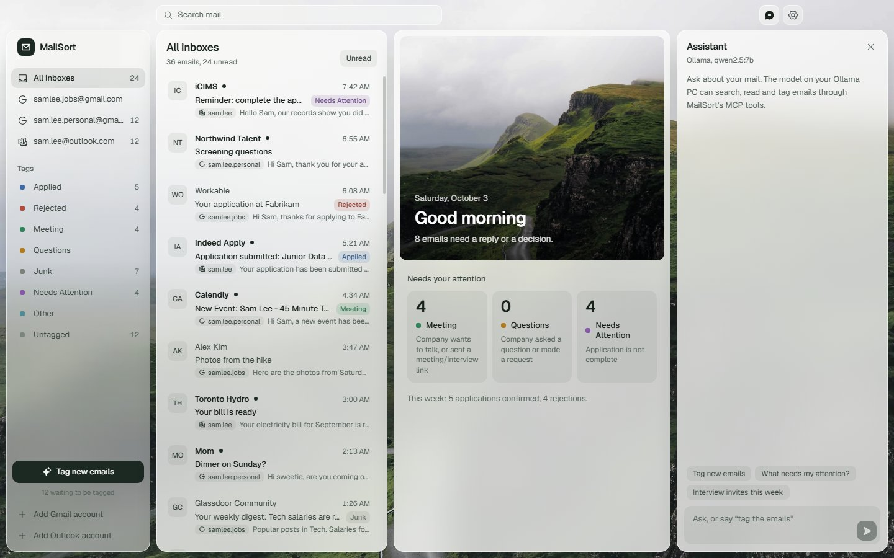
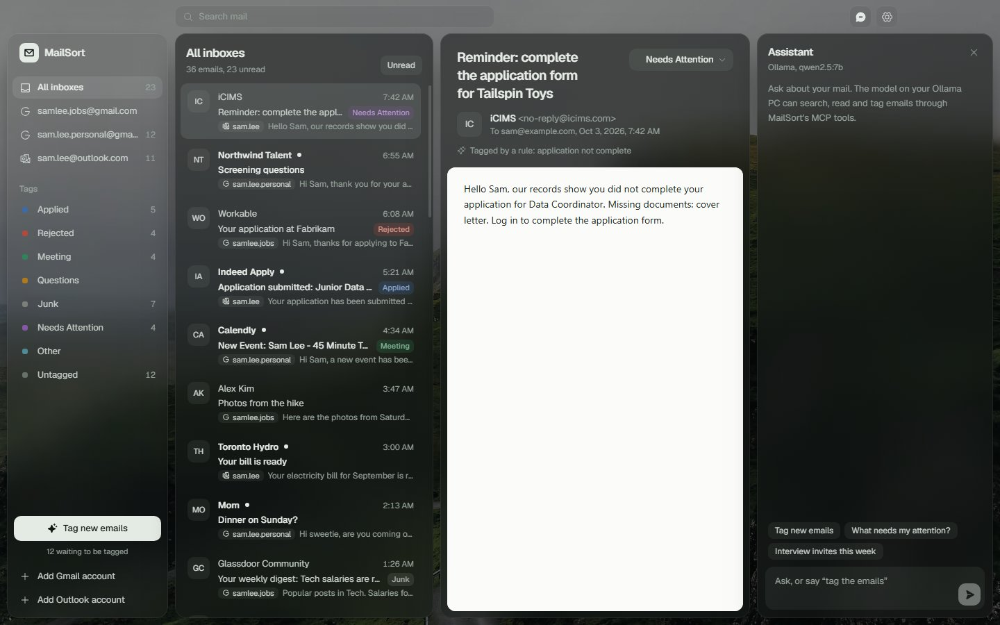

# MailSort

A desktop email app (Electron) that puts all your Gmail and Outlook accounts in one inbox. Add as many of each as you like. It also sorts job-search mail with a **local Ollama model** through an **MCP server**.





Type **"tag the emails"** in the Assistant panel, or click **Tag new emails**, and each new email gets one tag:

| Tag | Meaning |
|---|---|
| Applied | Company confirms they received the application |
| Rejected | Company rejected the application |
| Meeting | Company wants to talk, or sent a meeting/interview link |
| Questions | Company asked a question or made a request |
| Junk | Subscriptions, newsletters, passwords, verification codes, keys |
| Needs Attention | Application is not complete |
| Other | Cannot decide |

Tags are also saved to the mailbox as Gmail labels and Outlook categories (`AI/Meeting`, …), so you see them on your phone too.

**First-time setup** (Google/Microsoft app IDs, Ollama on your GPU PC): see [docs/SETUP.md](docs/SETUP.md).

## Several accounts

Click **Add Gmail account** or **Add Outlook account** as many times as you need. Each time, the Google or Microsoft account picker opens, so you can choose a different address even if your browser is already signed in.

- **All inboxes** shows every account together, and each email shows which mailbox it came from.
- Each account also has its own view, unread count and sync status.
- Tagging, search and the MCP tools work across all accounts, or on one account with `accountId`.
- Signing in again with an address you already added refreshes that account instead of adding a duplicate.

## Finding and sorting mail

- **Filters per view.** Every tag and mailbox has a filter bar with the filters that fit it: dates (Today, This week, Last week, 30 days) for Applied and Rejected, **Has invite** for Meeting, **Oldest first** for Questions and Needs Attention, **Newsletters** for Junk, **Needs review** for Other (low confidence tags and model guesses). Each view remembers its own filters.
- **Digest.** The overview shows emails per inbox and tag for this week or last week. A number opens the list already filtered to it.
- **Bulk actions.** Tick the box over a sender's initials (or Ctrl-click a row, Shift-click for a range), then mark read, mark unread or set a tag for all of them. Hover a row for quick read and tag buttons.
- **Read state syncs.** Opening or marking an email read or unread is also done in Gmail and Outlook.
- **Keyboard.** `j`/`k` move, `x` selects, `u` toggles read, `1` to `7` set a tag, `g` then a letter jumps to a tag, `/` searches, `?` lists everything.

## How it works

```
Electron main process
 ├─ core/       SQLite (node:sqlite, FTS5) · Gmail API + Microsoft Graph sync · tagger · tag write-back
 ├─ mcp/        MCP server over the core (7 tools + tag definitions resource)
 │   ├─ in-memory  → Assistant panel: Ollama /api/chat with tools ⇄ MCP client
 │   ├─ named pipe → stdio bridge for other MCP clients (Claude Desktop, MCP Inspector, …)
 │   └─ HTTP       → optional, 127.0.0.1 only
 └─ IPC → React UI (unified inbox, reading pane, tags, assistant, settings)
                                           Ollama on your GPU PC (http://<lan-ip>:11434)
```

The chat model never reads hundreds of emails itself. It calls the `tag_emails` tool, and the tool runs a fast pipeline:

1. **Rules first (0 ms).** Calendar invites and Calendly/Zoom/Teams links, rejection wording, "we received your application", verification codes, newsletters (`List-Unsubscribe`, Gmail Promotions), and sender domains you corrected twice. On the sample set, rules settle about 2 of 3 emails, and every tag they accepted was correct.
2. **The model for the rest.** One small request per email: From, Subject and the first ~1200 cleaned characters. The answer is constrained to a JSON schema with temperature 0. The system prompt is fixed so Ollama can reuse its prompt cache. Requests run 4 at a time.
3. **Learning from you.** When you change a tag, MailSort records the correction and shows similar ones to the model as examples. A sender domain you corrected twice becomes a rule. Your own tags are never overwritten.

## Speed, loading and storage

- **Instant start:** the inbox renders from the local database while sync runs in the background. The list is virtualized and loads 50 rows at a time.
- **Incremental sync:** Gmail `history.list` and Graph delta links, so only changes are downloaded. The first sync covers the last 90 days (configurable).
- **Lean storage:**
  - Each email keeps only cleaned text (≤ 4 KB) plus metadata and an FTS5 search index.
  - Full HTML downloads only when you open an email, then sits in a brotli-compressed cache capped at 200 MB (least recently opened is evicted).
  - Text older than the retention period is dropped, but subject, sender and tag are kept.
  - Attachments are never downloaded.
- **Remote images blocked** until you click **Load images**. This is faster and stops tracking pixels.
- **No re-work:** emails are classified once. A new classifier version re-tags only automatic tags.
- **No native modules:** SQLite comes built into Node/Electron (`node:sqlite`), so nothing needs compiling.

## Design

The UI follows the [Taste Skill](https://www.tasteskill.dev/) redesign rules (installed in `.claude/skills/`), applied to an app rather than a landing page:

- **Backdrop photo:** the photo fills the whole frameless window. Panels look frosted using a tiny pre-blurred copy of the photo (2 KB), so there is no live blur cost on machines without a GPU.
- **Fonts and icons:** Geist (bundled, works offline) and Phosphor icons.
- **Color:** one green-tinted neutral palette with an ink primary, so the tag colors are the only hues.
- **Shape:** one corner-radius scale: panels 16px, controls 10px, chips 7px.
- **States:** loading skeletons, a photo overview when no email is open, inline errors, and Settings as a slide-over panel.
- **Light and dark:** both themes follow Windows. Motion respects "reduce motion".

Backdrop photo: [Andrew Ridley on Unsplash](https://unsplash.com/photos/Kt5hRENuotI) (Unsplash License).

To regenerate the screenshots without opening a window: build, seed a demo folder, then run the app in capture mode:

```bat
npm run build
npx tsx scripts/seed-demo.ts %TEMP%\mailsort-demo
set MAILSORT_DATA_DIR=%TEMP%\mailsort-demo
set MAILSORT_CAPTURE=%TEMP%\mailsort-shots
set MAILSORT_THEME=dark
npx electron .
```

## MCP server

Tools: `list_accounts`, `sync_mail`, `search_emails`, `get_email`, `tag_emails` (with progress notifications), `set_tag`, `tag_summary`. Resource: `mail://tags`.

- **Inside the app:** the Assistant panel uses it automatically.
- **Other MCP clients (stdio):** **Settings → MCP server** shows the exact config to paste. It runs a small bridge that connects to MailSort, starting it in the background if needed. During development, after `npm run build`:
  ```json
  { "mcpServers": { "mailsort": { "command": "node", "args": ["C:/path/to/mcp/out/main/mcp-bridge.js"] } } }
  ```
  To try it in the MCP Inspector: `npx @modelcontextprotocol/inspector node out/main/mcp-bridge.js`
- **HTTP:** turn it on in Settings to get `http://127.0.0.1:3917/mcp` (Streamable HTTP, loopback only).

## Scripts

| Command | What it does |
|---|---|
| `npm run dev` | Start the app with hot reload |
| `npm test` | Unit and integration tests (rules, store, pipeline, providers, MCP server, chat agent) |
| `npm run eval -- --url http://<gpu-pc>:11434 --model qwen2.5:7b` | Accuracy, confusion matrix and ms/email on the labeled fixtures (`--llm-only` to test the model alone) |
| `npx tsx scripts/seed-demo.ts <dir>` | Fill a throwaway data folder with sample emails; run with `MAILSORT_DATA_DIR=<dir>` to try the UI without an account |
| `npm run typecheck` | TypeScript checks |
| `npm run dist` | Build a Windows installer (`dist/`) |

## Privacy

- Mail, tags and the database stay on this PC in `%APPDATA%\MailSort`. OAuth refresh tokens are encrypted with Windows DPAPI (Electron `safeStorage`).
- Email text is sent only to your own Ollama host.
- MailSort asks for read and modify access (to add labels/categories). It never sends or deletes mail.
